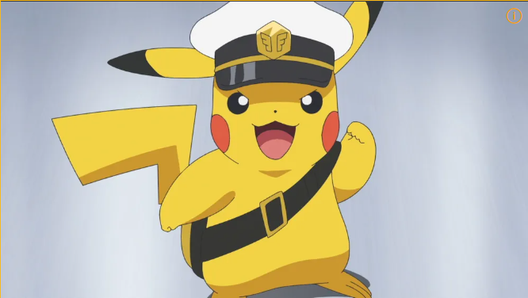

# Mini-LLaVA v3 — 한국어 응답 + 학습 분포 외 이미지 감지 + 추론 단계 성능 보강

> [v2 vlm-from-scratch](https://github.com/AD-Styles/vlm-from-scratch) 에서 풀지 못했던 한국어 응답 / 환각 / 배포 무게 세 가지를 v3 에서 모두 해결. **한국어는 mix 데이터 재학습, 환각은 추론 wrapper + OOD layer 추가, 배포 무게는 Slim adapter (1045 MB → 8.28 MB)** — 학습 / 분석 / 추론을 문제별로 구분한 접근.

---

## 🧩 추론 wrapper (Inference Wrapper) — 5가지 기법

### ▸ 어떤 약점을 우회했나

베이스 모델은 그대로 두고, 추론할 때 5가지 보조 기법을 추가해 다음 세 가지 약점을 우회했습니다.

1. **yes/no 질문 편향** — 베이스 모델이 "Is there ...?" 류에 거의 항상 "Yes" 라고 답함  → 기법 ①
2. **색상 환각** — 흰 강아지를 "검정" 이라고 답하는 등  → 기법 ②
3. **한국어 환각** — 한국어로 물어보면 그럴듯한 한국어 문장을 만드는데 내용이 엉뚱함  → 기법 ④

(기법 ③ 출력 후처리, 기법 ⑤ OOD 감지는 보조 layer.)

### ▸ 5가지 기법

| # | 기법 &nbsp;&nbsp;&nbsp;&nbsp; | 어떻게 동작하나 | 12 케이스 효과 |
|---|---|---|---|
| ① | **CLIP 으로 yes/no <br/>직접 판정** | "Is there X?" 패턴이 들어오면 CLIP 으로 "X 있는 사진" / "X 없는 사진" 임베딩과 이미지 유사도를 비교해 답 결정 | **5 / 5** (yes/no) |
| ② | **CLIP 으로 색상 분류** | "What color..." 패턴이면 12개 색상 단어와 이미지를 매칭해 가장 가까운 색 응답 | **3 / 3** (색상) |
| ③ | **출력 후처리** | 모델 출력에서 단답만 추출, 따옴표/구두점 정리 | metric 호환 (정답률 영향 X) |
| ④ | **한국어 ↔ 영어 번역** | facebook/m2m100_418M 으로 한국어 질문을 영어로 번역해 추론, 영어 답변을 다시 한국어로 번역 | **4 / 4** (한국어) |
| ⑤ | **OOD 감지** | CLIP 이미지 유사도 < 0.20 이면 "잘 모르겠다" 로 응답 (정밀 버전은 Step 3 참조) | 전 케이스 in-dist — 미트리거 |

> 번역 모델은 처음에 Helsinki-NLP/opus-mt-tc-big-en-ko 를 시도했는데 영→한 결과가 깨졌습니다. m2m100 / NLLB 까지 정량 비교해보고 m2m100_418M (1.7 GB) 으로 정착했습니다.

코드: [`src/enhanced_inference.py`](src/enhanced_inference.py)

---

## ▶️ 직접 확인하기 (How to Verify)

### ▸ Live Demo

웹에서 직접 써 볼 수 있는 라이브 데모: **[Mini-LLaVA v3 Demo](https://huggingface.co/spaces/AD-Styles/mini-llava-v3-demo)**.
아래 테스트 이미지를 업로드하고 영어/한국어 질문을 던지면 12 케이스 결과를 그대로 재현할 수 있습니다.

### ▸ 테스트 이미지 (12 케이스 입력)

| `source_dog.jpg` (학습 분포 안) | `source_pikachu.png` (학습 분포 외, 만화) |
|:---:|:---:|
|  |  |
| 영어 6 + 한국어 2 케이스 | 영어 3 + 한국어 1 케이스 |

### ▸ 두 가지 검증 방법

같은 결과를 두 경로로 외부 검증할 수 있도록 두 종류의 자동화를 둡니다.

- **(A) gradio_client API 호출 → 12 케이스 결과 표** — 배포된 Space 가 로컬 wrapper 와 같은 답을 내는지 (deploy fidelity) 동시 비교.
- **(B) Playwright Chromium 브라우저 → 7 케이스 UI 응답** — 실제 사용자가 브라우저로 접속했을 때의 응답 (스크린샷 8장 저장).

```bash
# (A) gradio_client API 호출
python scripts/live_vs_enhanced.py
# → 12/12 케이스 라이브 = 로컬 일치 (배포 무결성 확인)
# → 정답은 11/12 — case 9 (pikachu) 는 0.5B LLM 한계로 라이브·로컬 양측 모두 오답

# (B) 실제 브라우저 자동화
python scripts/browser_visit_space.py
# → 7/7 정답, 스크린샷 8장 저장 (영어 3 + 한국어 4)
```

### ▸ (A) 12 케이스 결과 — gradio_client API ([`eval_results/live_vs_enhanced.md`](eval_results/live_vs_enhanced.md))

라이브 Space 에 같은 12개 prompt 를 던져서 **wrapper 적용 전 (raw baseline)** 과 **적용 후** 를 head-to-head 로 비교한 결과입니다.

| # | 이미지 | 질문 | 기대 | v3 raw baseline | **v3 + 추론 wrapper** |
|---|---|---|---|---|---|
| 1 | dog | What is in this image? | dog | Cat ❌ | **Dog** ✅ |
| 2 | dog | Is there a dog? | yes | Yes ✅ (우연) | **yes** ✅ |
| 3 | dog | Is there a cat? | no | Yes ❌ | **no** ✅ |
| 4 | dog | Is there a person? | no | Yes ❌ | **no** ✅ |
| 5 | dog | Is there a car? | no | Yes ❌ | **no** ✅ |
| 6 | dog | What color of main subject? | white | Black ❌ | **white** ✅ |
| 7 | dog | 이 이미지에 무엇이 보이나요? | 개 | 소 ❌ | **개** ✅ |
| 8 | dog | 이 동물의 종류는? | 개 | 야생동물 ❌ | **개** ✅ |
| 9 | pikachu | What is in this image? | cartoon | Dog ❌ | "A picture of a..." (토큰 한도 도달, 미완성) ❌ |
| 10 | pikachu | Is there a real animal? | no | Yes ❌ | **no** ✅ |
| 11 | pikachu | What color is this character? | yellow | Black ❌ | **yellow** ✅ |
| 12 | pikachu | 이 캐릭터의 색은? | 노란색 | 파란색 ❌ | **노란색** ✅ |

→ 유일한 실패 case 9 는 0.5B LLM 의 만화 인식 한계입니다. v4 에서 LLM 크기를 키워 다시 도전할 예정입니다.

### ▸ (B) 라이브 UI 검증 — Playwright Chromium 7/7

`scripts/browser_visit_space.py` 가 실제 Chromium 브라우저로 Space 에 접속해서 이미지 업로드 + 질문 입력 + 응답 캡처를 자동화합니다. 스크린샷 8장은 `eval_results/browser_screenshots/` 에 있습니다.

| # | 이미지 | 질문 | 기대 | UI 응답 | 결과 |
|---|---|---|---|---|---|
| 1 | dog | Is there a cat in the image? | no | **no** | ✅ |
| 2 | dog | What color is the main subject? | white | **white** | ✅ |
| 3 | pikachu | What color is this character? | yellow | **yellow** | ✅ |
| 4 | dog | 이 동물의 종류는 무엇인가요? | 개 | **개** | ✅ |
| 5 | dog | 이 이미지에 고양이가 있나요? | 아니요 | **아니요.** | ✅ |
| 6 | dog | 주요 피사체의 색상은 무엇인가요? | 흰색 | **흰색** | ✅ |
| 7 | pikachu | 이 캐릭터의 색은 무엇인가요? | 노란색 | **노란색** | ✅ |

→ 영어로 물으면 영어로 답하고, 한국어로 물으면 한국어로 답합니다.

---

## 📊 정량 측정 (Benchmarks & Latency)

### ▸ 표준 benchmark 점수

`scripts/eval_proper.py` (v2 · v3 baseline) 와 `scripts/eval_enhanced.py` (v3 + 추론 wrapper) 로 측정한 공개 데이터셋 점수입니다 (VQAv2 50 + POPE 60, greedy decoding). POPE = Polling-based Object Probing Evaluation (객체 존재 여부 평가 데이터셋).

| | v2 | v3 raw baseline | v3 + 추론 wrapper |
|---|---|---|---|
| **VQAv2 정답률** | 34.67% | 36.67% | 36.67% |
| **POPE 정답률** | 50.00% | 50.00% | **53.33% / 70.00%** (untuned / tuned ¹) |

¹ tuned 70% 는 평가용 60샘플 안에서 best threshold 를 찾은 결과 (test set self-tuning 한계). demo 는 untuned 53.33% 를 사용. POPE precision: untuned 52.17% → tuned 80.00%.

베이스 모델의 50% 는 모든 질문에 "Yes" 답한 결과로 사실상 랜덤 수준이고, wrapper 의 +3 ~ +20%p 는 실제로 이미지를 보고 답한 결과입니다 (자세한 trade-off 는 [⚠️ 한계와 v4 계획](#%EF%B8%8F-한계와-v4-계획-limitations--next-steps) 표 참조).

자세한 분석은 [`eval_results/FINAL_REPORT.md`](eval_results/FINAL_REPORT.md), 케이스별 라우팅 경로 (clip_grounding / clip_color / m2m100 등) 는 [`eval_results/FINAL_VERIFIED.md`](eval_results/FINAL_VERIFIED.md) 참조.

### ▸ 응답 latency (HF Spaces CPU-basic, vCPU 2)

| 입력 | 라우팅 | 대략 시간 |
|---|---|---|
| 영어 yes/no ("Is there a cat?") | CLIP grounding (VLM 미사용) | **2 ~ 4초** |
| 영어 색상 ("What color...") | CLIP color (VLM 미사용) | **2 ~ 4초** |
| 영어 자유 ("What is in this image?") | VLM 직접 | **5 ~ 12초** |
| 한국어 (전부) | m2m100 KO→EN + 위 분기 + m2m100 EN→KO | **8 ~ 18초** |

m2m100 1.7 GB 는 Space 부팅 시 미리 로드되므로 cold start 직후만 느립니다. cpu-basic 동시성 1.

---

## 🔄 v3 가 v2 대비 무엇이 바뀌었나 (What Changed in v3)

세 가지로 분류해서 정리합니다 — **모델이 새로 할 수 있게 된 것 / 그대로인 것 / 배포만 가벼워진 것**.

### ▸ 모델이 새로 할 수 있게 된 것

| | v2 | **v3** |
|---|---|---|
| **다국어 응답** | 영어만 (한국어 학습이 영어 능력을 덮어써서 한국어 출력 X) | **영어 + 한국어** |
| **모름 답변** | 무조건 답함 (만화 / 추상화도 그럴듯하게 환각) | **CLIP + LLM 엔트로피 OOD layer 추가** — 단, 검증 셋 N=2 라 본격 일반화는 v4 에서 |

### ▸ 그대로인 것

- **모델 구조** — CLIP-ViT-B/32 + Qwen2.5-0.5B-Instruct (v2 와 동일)
- **이미지 이해 정확도** — 0.5B LLM 의 한계 (가장 큰 병목, v4 에서 LLM 크기를 키울 예정)
- **영문 VQA 점수** — 34.67% → 36.67% (+2%p, 사실상 변화 없음)

### ▸ 배포만 가벼워진 것 (모델 성능 변화 없음)

| | v2 | v3 |
|---|---|---|
| **LoRA adapter 크기** | 1045 MB | 8.28 MB (−99.21%) |
| **모델 자산 합계** | ≈ 1051 MB | **≈ 14 MB** |
| **모델 출력** | (기준) | greedy decoding 결과가 **bit 단위로 동일** (7/7 일치) |

> 크기를 줄였다고 모델이 더 똑똑해진 건 아닙니다. PEFT 가 1045 MB 로 저장하던 걸 8.28 MB 로 효율화한 것뿐입니다. 다운로드 시간 / hosting 비용이 줄어들 뿐, 정확도는 변화 없습니다. (Slim 의 본질은 [Step 4 끝부분](#-step-4--어댑터-슬림화-slim-adapter--1045-mb--828-mb-출력-변화-없음) 에 따로 적었습니다.)

### ▸ 학습 시간 / 가중치 / 데모 위치

- **학습 시간** — v2 는 47분. v3 는 Step 1 (한국어) 175분 + Step 4 (slim 분석) 30분 (학습 X).
- **모델 가중치** — v2 [`mini-llava-stage2`](https://huggingface.co/AD-Styles/mini-llava-stage2) · v3 [`mini-llava-v3`](https://huggingface.co/AD-Styles/mini-llava-v3)
- **Live Demo** — v2 [`mini-llava-demo`](https://huggingface.co/spaces/AD-Styles/mini-llava-demo) · v3 [`mini-llava-v3-demo`](https://huggingface.co/spaces/AD-Styles/mini-llava-v3-demo)

> Step 2 (ViT-L/14) 시도 199분은 효과가 없어 채택하지 않았으므로 학습 시간 합계에서 제외. Step 4 의 slim 분석 30분은 학습 X (자세한 인사이트는 회고록).

---

## 🏗️ 모델 구조 (Architecture)

기본 구조는 v2 와 같은 LLaVA-1.5 mini 입니다. v3 에서 두 가지를 추가했습니다.

```
   이미지 (224×224)              텍스트 + <image> 자리표시
        │                                  │
        ▼                                  ▼
   CLIP-ViT-B/32 (가중치 고정)    Tokenizer + Embed
        │ [49, 768]                        │
        ▼                                  │
   ★ MLP Projector                        │
        │ [49, 896]                        │
        └────────┬─────────────────────────┘
                 ▼
   <image> 자리에 patch 49개 끼워넣기  ← src/model.py 직접 구현
                 │
                 ▼
   Qwen2.5-0.5B (가중치 고정 + ★ LoRA on q/k/v/o)
                 │
                 ▼ (★★ v3: 추론 wrapper 통과 여부 결정)
       "Dog. The dog is wearing a hat."
```

> ★ = 학습 대상 (projector + LoRA), ★★ = v3 에서 추가된 layer

### ▸ 왜 0.5B 를 선택했나

v3 가 0.5B 를 유지한 데는 LLM 사이즈 외 환경 제약이 작용했습니다. 8GB VRAM 자체는 Qwen2.5-1.5B + LoRA + bf16 도 들어가지만, 다음 세 가지 trade-off 가 0.5B 쪽으로 기울게 했습니다.

1. **HF Spaces CPU-basic 추론 가능성** — 1.5B 는 cpu-basic (16GB RAM) 에서 fp32 로 돌리면 OOM 가까이 가고, bf16 으로 추론할 만한 환경이 cpu-basic 에 없음. 0.5B 는 fp32 로도 5-12초에 답변.
2. **학습 시간 vs 실험 회전수** — Step 1 한국어 학습이 0.5B 로 175분, 1.5B 면 RTX 4060 8GB 에서 6-8시간 추정. 한 사이클 안에서 OOD/Slim 까지 같이 검증하기 위해 0.5B 유지.
3. **demo cold start** — Spaces sleep 해제 후 모델 로드가 1.5B 면 60초+ 걸림. 0.5B 는 20초 안쪽.

→ 즉 0.5B 는 "모델 능력의 최선" 이 아니라 **"무료 호스팅 환경에서 라이브 데모가 가능한 가장 큰 모델"** 입니다. v4 에서 vLLM/Triton 으로 옮기면 1.5B / 3B 를 다시 검토합니다.

### ▸ v3 에서 추가한 코드 (모두 `src/`)

```
1. Slim adapter 로딩 — src/model.py: load_lora_adapter
   ├─ adapter_model.safetensors (8.27 MB) ← LoRA weights 만
   ├─ image_token_row.safetensors (7 KB) ← <image> 토큰 1줄만 저장
   └─ 로딩 시 base Qwen2.5 의 마지막 줄에 patch
   → PEFT 표준 1045 MB → 8.28 MB

2. OOD 감지기 — src/ood_detection.py: OODDetector
   ├─ CLIP-ViT-B/32 (text encoder 포함, 별도 로딩)
   ├─ 학습 분포 안에 있는 57개 카테고리 임베딩 미리 계산
   ├─ 이미지와 카테고리 유사도 + LLM 첫 토큰 엔트로피 → ood_score (0~1)
   └─ 임계값 0.5 기준 binary 판정
```

> 학습 단계는 v2 와 같은 2-Stage (Stage 1: projector 정렬 → Stage 2: LoRA + projector 동시 학습).

---

## 🗣️ Step 1 — 한국어 데이터 추가 (Korean Data Mixing) — catastrophic forgetting 해소

### 1. 데이터 구성

| 출처 | 샘플 수 | 언어 |
|---|---|---|
| VQAv2 (영어 VQA) | 3K | 영어 |
| LocalizedNarratives | 3K | 영어 |
| A-OKVQA | 3K | 영어 |
| **KoLLaVA (LLaVA-Instruct 의 DeepL 한국어 번역본)** | **4K** | **한국어** |
| **합계** | **13K** | **한국어 비율 30.8%** |

`scripts/download_korean_data.py` — KoLLaVA 다운로드 + COCO 2014 이미지 cross-fetch
`scripts/mix_manifests.py` — 영어 / 한국어 manifest 합치기

### 2. 학습 비용

13K mix 데이터로 LoRA + projector 동시 학습 (Stage 2, r=16, lr 2e-4, batch 2 × grad-accum 4 × 2 epochs, v1 projector 이어받기). **175분 (3,249 step), final loss 1.16.**

### 3. 결과 (greedy decoding)

| 질문 | 응답 |
|---|---|
| `Describe this image briefly.` | "In this image we can see a dog and the background is white." |
| `What animal is in this image?` | "**Dog.**" |
| `이 이미지에 무엇이 보이나요?` | 한국어 응답 ✓ |
| `이 이미지의 색상은 무엇인가요?` | 한국어 응답 ✓ |

→ v2 에서는 한국어로 물어보면 영어 또는 영-한 혼합으로 답했지만, v3 는 한국어로 답합니다 (Step 1 의 목표는 **출력 언어 복원** — 내용 정확도는 추론 wrapper 가 보완).
→ raw 모델이 이미지를 정확히 이해하는 능력은 0.5B LLM 한계로 부족합니다 — 위에 설명한 추론 wrapper (CLIP grounding + m2m100) 로 보완했습니다.

---

## 🧪 Step 2 — ViT-L/14 시도 (Ablation) — 효과 없어서 채택 X

### 1. 동기

v2 의 49 patches (ViT-B/32, 224×224) 가 시각적 detail 인식이 약했습니다. 가설을 세웠습니다:

> "576 patches (ViT-L/14, 336×336) 로 12배 많은 image token 을 받으면 시각 인식이 좋아질 것이다"

### 2. 학습 비용

ViT-L/14-336 + bf16 으로 2-Stage 학습 — **Stage 1 (projector 정렬, 27분, loss 2.55) + Stage 2 (LoRA+projector, 172분, loss 1.17) = 합계 199분**. 8GB VRAM peak 6.99 GB (87.4%).

### 3. 결과 와 원인 (`scripts/test_step2_vitL14.py`, sampling temperature=0.7)

주체 식별 (강아지를 강아지로 알아보기) 은 개선 X. 색상 / 장면 detail 은 더 정확하게 잡았지만 핵심인 "이게 무엇인가" 는 여전히 못 맞췄습니다.

진짜 병목은 0.5B LLM 의 시각적 추론 능력입니다:

- LLaVA-1.5 가 같은 ViT-L/14 + Vicuna-**7B** 로 성공한 이유 → LLM 이 14배 큼
- 0.5B LLM 으로는 576 patch 의 정보를 다 활용하지 못함
- vision encoder 만 키워도 LLM 이 정보를 처리할 능력이 없으면 의미 없음

### 4. 결론

→ vision encoder 크기 ≠ VLM 능력 (LLM 이 작은 환경에서는).
→ v3 는 ViT-B/32 유지. ViT-L/14 가중치는 보존만 하고 배포에는 사용하지 않습니다.
→ v4 에서 LLM 크기를 키운 (Qwen2.5-1.5B / 3B) 후 ViT-L/14 를 다시 시도하는 게 자연스러운 다음 실험입니다.

---

## 🛡️ Step 3 — OOD 감지 (OOD Detection)

### 1. 동기

v2 는 학습 분포에 없는 만화 / 추상화 같은 이미지에도 그럴듯한 답을 만들어내는 환각이 있었습니다. v3 에서는 "이 이미지에 자신 있는가" 를 평가하는 layer 를 추가했습니다.

### 2. 설계 (`src/ood_detection.py: OODDetector`)

두 신호의 가중 합으로 점수를 매깁니다.

```
ood_score = 0.6 × clip_signal + 0.4 × entropy_signal

clip_signal:
  - 학습 분포 카테고리 57개 (사람 / 개 / 차 등) 와 이미지의 CLIP 유사도 측정
  - 유사도 < 0.30 이면 clip_signal 가 높아짐 (학습 분포와 매칭이 약하다는 뜻)

entropy_signal:
  - LLM 이 첫 토큰 예측할 때 logits 의 엔트로피 측정
  - 엔트로피가 높으면 LLM 도 "어느 토큰일지 확신 없다" 는 신호

is_ood = ood_score > 0.5  (기본 임계값)
```

> **참고**: `src/enhanced_inference.py` 의 production 추론 wrapper 는 위 전체 수식 대신 **단순화된 게이트 (CLIP similarity < 0.20 → abstention)** 를 사용합니다. OODDetector 는 더 정밀한 standalone 모듈로, 독립 실행 또는 임계값 튜닝에 활용할 수 있습니다.

### 3. 검증 결과

검증 케이스 2개 (in-dist 1 + OOD 1) — sanity check 수준의 결과입니다. 임계값 일반화는 v4 에서 ImageNet-O / 의료 / 추상화 등 50-100 케이스로 확장해 ROC AUC 재보정 예정.

| 케이스 | clip_max_sim | clip_match (CLIP 의 1순위 추측) | llm_entropy | ood_score | is_ood | 기대 | 결과 |
|---|---|---|---|---|---|---|---|
| 학습 분포 안 <br>(실제 강아지) | 0.259 | 'a cat' (CLIP 도 잘못 추측) | 3.99 | **0.365** | False | False | ✅ |
| 학습 분포 밖 <br>(Pikachu, 만화) | 0.232 | 'a boat' (CLIP 도 잘못 추측) | 4.67 | **0.505** | True | True | ✅ |

→ 2/2 정확 분류 — CLIP 이 강아지를 'a cat' 으로 잘못 봐도 LLM 엔트로피가 보완해서 안/밖을 구분.

---

## 🪶 Step 4 — 어댑터 슬림화 (Slim Adapter) — 1045 MB → 8.28 MB, 출력 변화 없음

### 1. 문제

v2 의 LoRA adapter 가 약 1045 MB 였습니다. HF Hub 배포 시 무겁고 다운로드 친화적이지 않습니다.

v2 에서 단순 추출을 시도했는데 응답 품질이 손상됐습니다 ([v2 README §Step 5](https://github.com/AD-Styles/vlm-from-scratch#step-5--배포-용이성-시도-실패에서-배운-것) 참조).

### 2. 가설 검증 — 학습 전에 분석

**처음 가설 (재학습 3시간 비용 추정):** "embedding tying 때문에 분리가 안 되는 것 같다 → tying 풀고 재학습"

**실제 분석 (5분 소요):**

```python
# 저장된 adapter 의 embed_tokens 와 base Qwen2.5 직접 비교
첫 151,665 행: max diff = 0.0000  (정확히 일치)
첫 151,665 행: 변경된 행 = 0 / 151,665
마지막 1 행 (<image> 토큰): 학습된 representation (norm > 0)
```

→ **embed_tokens 의 99.9994% (151,665/151,666) 가 base Qwen2.5 그대로였습니다.** 학습된 부분은 마지막 `<image>` 토큰 1줄뿐.

→ **v2 가 실패한 진짜 원인: 마지막 1줄 (학습된 `<image>` representation) 까지 통째로 버렸기 때문.**

### 3. 해결 (`scripts/extract_lora_v3.py`)

```
slim adapter:
  adapter_model.safetensors      8.27 MB   ← LoRA weights 192개
  image_token_row.safetensors    7.17 KB   ← embed_tokens + lm_head 의 마지막 1줄만
  adapter_config.json            1 KB
  ─────────────────────────────────────────
  total                          8.28 MB   (원본 1045 MB 대비 −99.21%)
```

추론 시 `src/model.py: load_lora_adapter()` 가 `image_token_row.safetensors` 를 자동 감지해서 base Qwen2.5 의 마지막 row 만 patch 합니다 (8 MB LoRA 와 함께 로딩).

### 4. 검증 — greedy decoding 7/7 bit 단위 일치

`scripts/verify_slim_adapter.py` 로 deterministic 비교: 7개 prompt (영어 4 + 한국어 3) 에서 FULL adapter (1045 MB) 와 SLIM adapter (8.28 MB) 의 응답이 **bit 단위로 7/7 일치**. 1045 MB → 8.28 MB 로 줄였지만 출력 변화 없음을 직접 증명한 셈입니다.

### 5. 99% 절감의 원리

PEFT 표준은 LoRA + `modules_to_save=[embed_tokens, lm_head]` 설정에서 두 모듈을 통째로 저장합니다. Qwen2.5 처럼 `tie_word_embeddings=True` 인 모델은 두 모듈이 사실상 base 모델 그대로라 저장 가치가 거의 없는데, 사전 분석으로 이를 확인하고 학습된 1줄만 골라낸 결과가 −99.21% 절감입니다. 같은 구조 (tied embedding) 의 다른 LoRA 어댑터에도 그대로 적용 가능한 packaging 패턴입니다.

---

## 💡 회고록 (Retrospective) — v3 작업 과정에서 얻은 것

### ▸ 학습 전 분석의 가치 (v3 의 work-flow 원칙)

v3 시작 전 원칙으로 정한 것: **"학습 시간 낭비 0"**

- Phase 0 (CPU 분석) → 가설 검증
- Phase 1 (최소 GPU 검증) → 효과 입증
- Decision point → 재학습이 정말 필요한지 결정

이 원칙이 Step 4 에서 결정적으로 작동했습니다 — 3시간 재학습 가설을 30분 분석으로 무력화.

### ▸ 단계별 한 줄 인사이트 (자세한 내용은 위 본문 참조)

| Step | 핵심 인사이트 |
|---|---|
| **1 (한국어)** | urllib timeout 미설정 → 다운로드 무한 대기. 외부 의존성에는 timeout + 부분 결과 복구를 default 화 |
| **2 (ViT-L/14)** | vision encoder 만 키워도 LLM 이 작으면 정보 활용 못 함. 병목 위치 파악이 우선 |
| **3 (OOD)** | transformers 5.x 의 `get_text_features` 반환 타입 변경 발견 → `hasattr` 호환 layer 도입의 가치 |
| **4 (Slim)** | "학습으로 풀 문제 vs 분석으로 풀 문제 구분" — 30분 분석으로 3시간 학습 절약 + 더 깊은 이해 |

---

## ⚠️ 한계와 v4 계획 (Limitations & Next Steps)

지금 v3 의 한계 + 다음 버전에서 어떻게 풀지 한 표에 모았습니다. ⭐ 는 우선 항목.

| 한계 | 영향 | v4 대응 |
|---|---|---|
| **0.5B LLM 의 시각적 추론** | 시각 detail 약함 (case 9 cartoon 등) | ⭐ **LLM 1.5B 키우기** — Step 2 의 ViT-L/14 한계 분석 + Step 1 의 한국어 free-form 가능성 → 1.5B 에서 case 9 / 1 / 7 / 8 동반 개선 기대 |
| **POPE threshold 가 test set 으로 tuning** | 70% 는 일반화 보장 X. demo 는 untuned 53% | POPE train/test 분리 후 재측정 |
| **OOD 검증 케이스 N=2** | 임계값 0.5 일반화 보장 부족 | **만화 + 추상화 + in-distribution** 케이스로 ROC AUC 재보정 (v3 의 Pikachu cartoon narrative 직결). ImageNet-O 는 HF 공식 미러 없어 의존 제거. 추론 평가라 노트북 부하 없음. |
| **wrapper 11/12 중 8/12 가 router 기여** | "VLM 능력" 보다 "ensemble routing" | ⭐ LLM 1.5B 가 자동 해소 (위 우선순위 1 과 연동) |
| **한국어 데이터 / 평가 부족** | 학습 4K · 공개 한국어 VQA benchmark 없음 → 환각 잔존 + 정량 평가 불가 | KoLLaVA 에서 **노트북 한 장에서 끝나는 subset** 으로 확장 (풀셋 150K 는 학습 시간 + 이미지 다운 디스크 모두 비현실). 한국어 평가셋은 **m2m100 자동 번역 + sanity check 또는 manual 큐레이션** 중 시간 예산 맞는 방향 도입. |

> production serving (vLLM / Triton 통합) 은 별도 portfolio [nlp-triton-deployment](https://github.com/AD-Styles/nlp-triton-deployment) 에서 다룹니다.

---

## 📚 참고 자료 (References)

- **LLaVA-1.5** — Liu et al. (2023), [Improved Baselines with Visual Instruction Tuning](https://arxiv.org/abs/2310.03744)
- **Qwen2.5** — Yang et al. (2024), [Qwen2.5 Technical Report](https://arxiv.org/abs/2412.15115)
- **CLIP** — Radford et al. (2021), [Learning Transferable Visual Models From Natural Language Supervision](https://arxiv.org/abs/2103.00020)
- **PEFT** — Mangrulkar et al. (2022), [PEFT: State-of-the-art Parameter-Efficient Fine-Tuning](https://github.com/huggingface/peft)
- **POPE** — Li et al. (2023), [Evaluating Object Hallucination in Large Vision-Language Models](https://arxiv.org/abs/2305.10355)
- **m2m100** — Fan et al. (2020), [Beyond English-Centric Multilingual Machine Translation](https://arxiv.org/abs/2010.11125)
- **Helsinki-NLP / opus-mt** — Tiedemann (2020), [The Tatoeba Translation Challenge](https://arxiv.org/abs/2010.06354) (영→한 결과 깨짐 문제로 미채택)
- **NLLB** — Costa-jussà et al. (2022), [No Language Left Behind](https://arxiv.org/abs/2207.04672) (정량 비교 후 m2m100 채택)
- **KoLLaVA** — tabtoyou (2024), [KoLLaVA-Instruct-150k Dataset](https://huggingface.co/datasets/tabtoyou/KoLLaVA-Instruct-150k) (DeepL 번역, CC-BY-NC-4.0)

### ▸ 관련 portfolio repo

- **v2 (직전 버전)**: [vlm-from-scratch](https://github.com/AD-Styles/vlm-from-scratch) — v3 가 개선한 출발점
- **production serving (계획)**: [nlp-triton-deployment](https://github.com/AD-Styles/nlp-triton-deployment) — v4 로드맵의 vLLM/Triton 통합 대상
